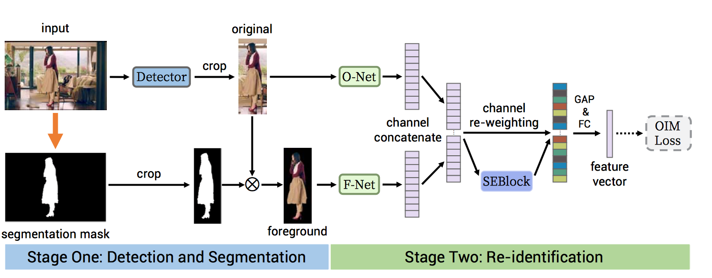

# 1.Person Search via A Mask-guided Two-stream CNN Model

## 1.Introduction

person search 包含了两步：pedestrian detection and person re-identification

person search需要在整张图片上搜索person，不是直接拿出一张已经截取好的person图片和你进行比较。

现在很多person search的都是一个基于Faster R-CNN的端到端学习。在Faster R-CNN提取出person后，加一个全连接层来提取特征，然后进行reid. 

在训练的时候，两个loss一起优化：
* 1.Faster R-CNN losses
* 2.person categorization loss

但是，我们认为在detection and re-ID之间共享这个representations是不太合适的，因为对于detection来说，所有的人被认为是一类，目标是把人从背景中区别出来。因此，学到的representations集中于不同人的相同特征。比如：身体形状。

但是对于reid任务来说，不同的人被认为是不同的类。目标是最大化他们之间的差异，representations集中在学习不同人的特征。比如：clothing, hairstyle.

简言之，就是detection 是为了建模inter-class difference，而reid是为了建模intra-class difference. 所以，应该把这两个任务分开而不是合并。

在reid领域，大家普遍认为应该在人（foreground）上提取discriminative information，背景（background）是不利因素，应该被忽略。一个直观的想法就是只提取foreground person patch的特征，忽略background area.

但是，如此简单地把所有的background information丢掉，可能反而会对reid系统不好。主要来自于两个方面：
* 1.he feature extraction procedure may gather errors from imperfect or noisy segmentation masks, i.e. identification information loss caused by fractional body shape

* 2.background information sometimes acts as useful context, e.g. attendant suitcases, handbags or companions.

所以丢掉所有的background area将忽略掉一些对reid有帮助的cues.所以我们认为在主要考虑foreground person的基础上，同时也要考虑background作为一个补充的线索。

基础上面的讨论，我们提出了一个person search的新方法。它由两个阶段组成：
* 1.pedestrian detection
* 2.person re-identification

我们单独地处理他们，不共享任何的representations.

此外，我们提出了一个Two-stream CNN，对foreground person and original image独立地进行建模，目的是extract more informative features for each identity and still consider the complementarity of the background.整个框架如下图所示，后面会详细讨论。

我们的贡献主要是三个方面：
* 1.在person search问题上，这是第一篇单独处理pedestrian detection and person re-identification两个任务比联合处理好的。

* 2.我们提出了一个Mask-guided Two-Stream CNN Model (MGTS) 来进行reid，which explicitly makes use of one stream from the foreground as the emphasized in- formation and enriches the representation by incorporating another separate stream from the original image.

* 3.Our proposed method achieves mAP of 83.0% and 32.6% on CUHK-SYSU [3] and PRW [2] benchmarks respectively, which improves over the previous state-of-the- arts by a large margin (more than 5pp).

## 2.Related Work

Person search

# reference

[1].[Person Search via A Mask-guided Two-stream CNN Model](https://zhuanlan.zhihu.com/p/39282286)

要求：

PPT要求：每篇文章的ppt为5-6页，分别包括：motivation（创新点），method（方法），
实验分析（都做了哪些实验，分别是为了证明作者的哪些claim，实验是否well-supported作者的claim）
